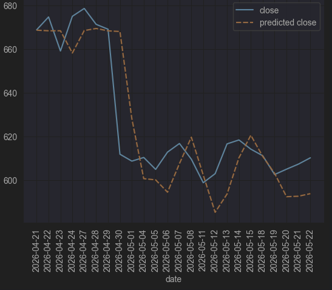

# Stock Price Prediction

## Problem Statement

In this project I used numerical data such as stock prices and trading volume alongside relevant news articles in attempt to accurately predict stock prices. This will assist individual investors in making trading decisions by providing them with insight and predictions of the current stock market. With my solution people are less likely to time the market wrong resulting in a reduced return. In this project I wanted to look at news article sentiment as well as pricing data as news articles can help predict trading behaviour.

## Deployment Link

The application is deployed on streamlit community cloud https://stockpriceprediction-77xj5kzyytrrfjc9byuefu.streamlit.app/. It also uses a cron job on GitHub via GitHub actions to refresh the data daily. If something where to go wrong with the deployment please see the attached video stock_price_prediction_demo.mp4.

## Intended Users

Anyone interested in the stock market and investments with awareness of the potential risks.

## Success Metrics

To measure the success I took an average of how close my models predicted close prices were to the actual close prices of a stock on a particular day. The exact metric I used was RMSE (root mean squared error). RMSE squares the differences before averaging them and calculating the square root. Compared to other models like those featured in the references I also combine news data which is added complexity in the hope of enhancing predictions.

## How To Run

- The best way to view the project would be from the front end which is hosted on streamlit community cloud
- To run the individual notebooks that store the code for my models models/neural_network.ipynb, models/sentiment_model.ipynb ensure that you have installed all requirements and have a Hugging Face API Key in a .env file
- I don't recommend running the data pipeline functions as they require a paid api key, just run the models in the model sub-directory.

```Bash
pip install -r requirements.txt
```

```env
# Setup a file named .env with the following in the base directory
hugging_face_token=<insert token>
```

## Demo Path

- Press the run button in your chosen IDE to run the models on the provided CSV files.

## Results


- **{'train_rmse': 11.275712966918945, 'test_rmse': 15.504542350769043}**
- Here you can see my model began to overfit as the train error was smaller than the test error.

## Limitations And Known Issues

- The model seems to often be late to emerging patterns in the market such as sharp increases or decreases in close price which if traded upon could result in loss of money.
- The model also seems to either over or under emphasise swings in the market mis-guessing the extent of that swing.
- The model is only trained on one ticker (META), training on the wider stock market would likely result in better predictions.
- The model is limited by the data used to train it, only 3 months of history was available for news data and pricing data cannot be fetched in real time only after the end of the previous trading day.

## Ethics/Risks And Mitigations

- Do not use the model as the only source determining trading decisions.
- Do not use the model to inform trades with money you are not prepared to lose.
- If your interested in using the model to inform trades don't start with actual money instead paper trade.
- Another risk is people taking the predictions as absolute truth and being disappointed when they are incorrect.

## References / Acknowledgements

The following videos and courses taught me about LSTMs and the standard way of building deep learning models to forecast stock prices: 
- (Greg Hogg, YouTube, 2023, Amazon Stock Forecasting in PyTorch with LSTM Neural Network (Time Series Forecasting) | Tutorial 3, https://www.youtube.com/watch?v=q_HS4s1L8UI&t=147s)
- (Neural Nine, YouTube, 2025, Stock Price Prediction in Python with PyTorch - Full Tutorial, https://www.youtube.com/watch?v=IJ50ew8wi-0)
- (Jasmin Ludolf & Thomas Hossler, DataCamp, 2026, Introduction to Deep Learning with PyTorch, https://app.datacamp.com/learn/courses/introduction-to-deep-learning-with-pytorch)
- (Michal Oleszak, DataCamp, 2025, Intermediate Deep Learning with PyTorch, https://app.datacamp.com/learn/courses/intermediate-deep-learning-with-pytorch)
- (3Blue1Brown, YouTube, 2018, Neural Networks Playlist, https://www.youtube.com/watch?v=aircAruvnKk&list=PLZHQObOWTQDNU6R1_67000Dx_ZCJB-3pi)
